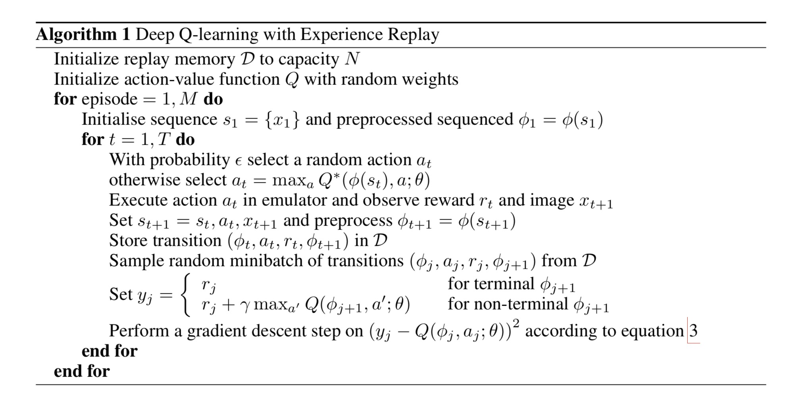
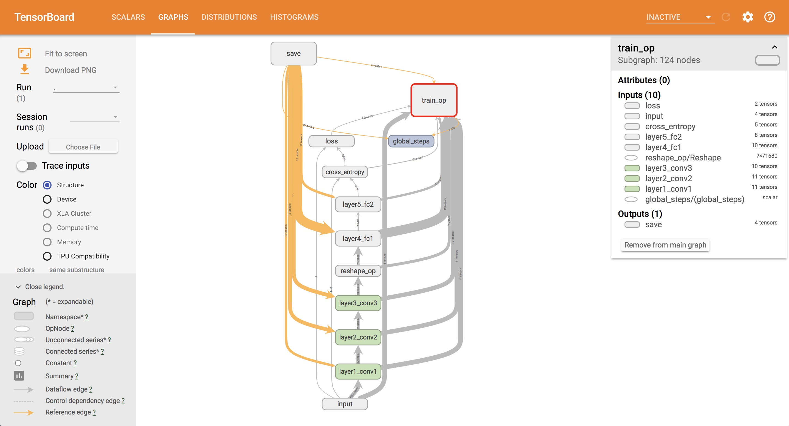
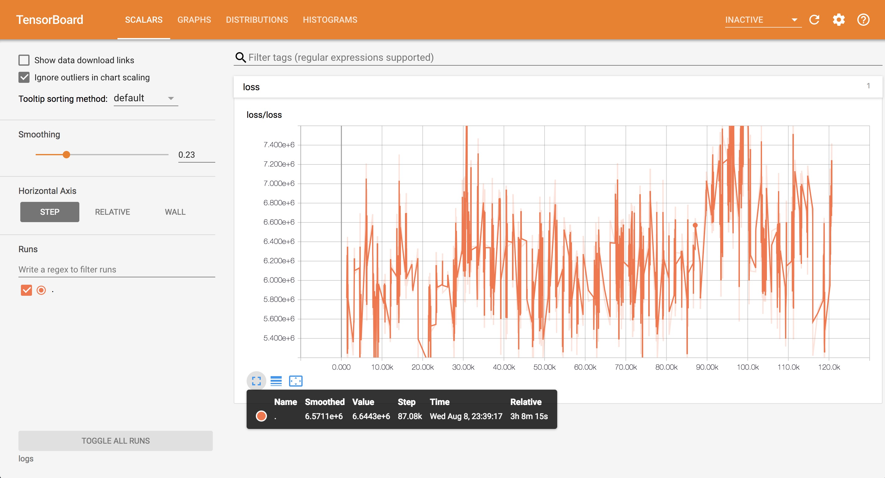

# Playing Retro Airstriker-Genesis game using Deep Q-learing with Experience replay

## Introduction
I implement the simple DQN algorithm to play Openai-retro Airstriker-Genesis game to studing basic deep reinforment learning. 

## Algorithm
Here is pseudo-code of Deep Q-learnig with experience replay.

## Networks
Here is the neuron network portion of DQN-v2013, it has three convolutional layers and two ful-connetion layers. The input is the original image from enviroment itself, and ouput is propability of each action of action space. 

## Requirements
- Python 3.6+
- [openai retro](https://contest.openai.com/2018-1/details/)
- [tensorflow 1.5.0](https://www.tensorflow.org/)
- [numpy 1.14.0](http://www.numpy.org)

## Usage
First, install all requirements.

To train a model:

    $ python main.py --train True

To test your model via play the game:

    $ python main.py --train False

## Results
Currently, our best model can play the game warping to level 2.

## Simple results
History graph of loss.

## License
WTF (MIT)